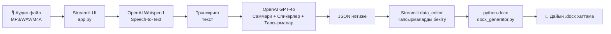

# 🗂️ Самұрық-Қазына үшін кеңестерді автохаттамалау және тапсырмаларды бекіту жүйесі

**Meeting Minutes & Task Management AI System**


> **HackAlem AI хакатоны** аясында дайындалған кейс: *«Кеңешмелерди автопротоколдоо жана тапшырмаларды бекитүү системасы»*.

---

## 📌 1. Жоба туралы

Бұл жүйе — **Самұрық-Қазына** тобындағы компаниялар үшін ішкі кеңестерді, жиналыстарды және операциялық отырыстарды **автоматты түрде хаттамалауға** арналған AI-негізделген веб-қосымша.

Пайдаланушы кеңестің аудиожазбасын жүктейді, ал жүйе:

- дыбысты мәтінге түрлендіреді (**Speech-to-Text**),
- сөйлеушілерді (спикерлерді) ажыратады,
- кеңестің қысқаша қорытындысын жасайды,
- тапсырмаларды, жауапты тұлғаларды және мерзімдерді **құрылымдалған түрде** бөліп алады,
- нәтижесінде дайын, ресми **`.docx` хаттама** файлын генерациялайды.

Бұл шешім хатшылар мен жобалық менеджерлердің қолмен хаттама жазуға жұмсайтын уақытын айтарлықтай қысқартады және адами факторға байланысты қателерді азайтады.

---

## ✨ 2. Негізгі мүмкіндіктері (Features)

| № | Мүмкіндік | Сипаттамасы |
|---|-----------|-------------|
| 🎙️ | **Аудио жүктеу** | `MP3`, `WAV`, `M4A` форматындағы кеңес жазбаларын жүктеу |
| 🗣️ | **Speech-to-Text (STT)** | Қазақ, орыс және **аралас («шала-қазақ»)** тілдердегі сөйлеуді жоғары дәлдікпен мәтінге түрлендіру (OpenAI Whisper-1) |
| 📝 | **Автоматты саммари** | Кеңестің мазмұнын 3–5 сөйлемдік қысқаша қорытындыға жинақтау |
| 👥 | **Спикерлерді анықтау** | Мәтін мазмұны бойынша сөйлеушілерді (спикерлерді) болжамдап ажырату |
| ✅ | **Тапсырмаларды бөліп алу** | Тапсырма, жауапты тұлға (Ответственный) және орындау мерзімін (Срок) JSON форматында құрылымдау |
| 🖊️ | **Интерактивті өңдеу** | Streamlit-тің `data_editor` кестесінде тапсырмаларды тексеру, түзету және бекіту |
| 📄 | **DOCX экспорт** | Дайын, ресми форматталған хаттаманы бір батырмамен `.docx` түрінде жүктеп алу |
| 🌐 | **Веб-интерфейс** | Қосымша орнатуды қажет етпейтін, браузерде жұмыс істейтін қарапайым әрі ыңғайлы интерфейс |

---

## 🏗️ 3. Жоба архитектурасы мен технологиялар стегі

### 3.1 Жалпы ағын (High-level flow)



### 3.2 Технологиялар стегі

| Қабат | Технология | Рөлі |
|-------|-----------|------|
| **Frontend / UI** | [Streamlit](https://streamlit.io) | Пайдаланушы веб-интерфейсі, файл жүктеу, интерактивті кестелер |
| **STT (Speech-to-Text)** | OpenAI **Whisper API** (`whisper-1`) | Аудионы қазақша/орысша/аралас тілде мәтінге түрлендіру |
| **NLP / LLM** | OpenAI **GPT-4o** | Мәтінді сараптау, саммари жасау, спикерлер мен тапсырмаларды JSON форматында бөліп алу |
| **Деректерді өңдеу** | **Pandas** | Тапсырмалар кестесін өңдеу және Streamlit кестесіне бейімдеу |
| **Құжат генерациясы** | **python-docx** | Ресми `.docx` хаттама файлын құрастыру (тақырып, саммари, кесте) |
| **Тіл** | Python 3.10+ | Негізгі бэкенд логикасы |

### 3.3 Жоба құрылымы

```
project/
├── app.py                # Streamlit негізгі интерфейсі (UI)
├── utils.py               # Whisper STT + GPT-4o логикасы (транскрипция, структуризация)
├── docx_generator.py      # .docx хаттама генерациялау модулі
├── requirements.txt       # Тәуелділіктер тізімі
└── README.md               # Осы файл
```

---

## ⚙️ 4. Орнату және іске қосу нұсқаулығы (Installation & Usage)

### 4.1 Талаптар (Prerequisites)

- Python **3.10** немесе жоғары нұсқасы
- Жарамды **OpenAI API кілті** ([platform.openai.com](https://platform.openai.com/api-keys))
- Интернет байланысы (OpenAI API-ге сұраныс жіберу үшін)

### 4.2 Орнату қадамдары

```bash
# 1. Репозиторийді клондау немесе жоба папкасына өту
cd project

# 2. Виртуалды орта жасау (ұсынылады)
python -m venv venv
source venv/bin/activate      # Windows: venv\Scripts\activate

# 3. Тәуелділіктерді орнату
pip install -r requirements.txt
```

### 4.3 Қосымшаны іске қосу

```bash
streamlit run app.py
```

Іске қосылғаннан кейін браузерде автоматты түрде мына мекенжай ашылады:

```
http://localhost:8501
```

### 4.4 API кілтін баптау

Қосымша ашылғаннан кейін, сол жақ бүйірлік панельде (**Sidebar → ⚙️ Баптаулар**) өз OpenAI API кілтіңізді енгізіңіз:

```
sk-...................................
```

> 🔒 API кілті тек ағымдағы сессия ішінде жадта сақталады және серверде тұрақты түрде сақталмайды.

---

## 🎬 5. Жүйені тексеру сценарийі (Demo workflow)

Жүйенің толық жұмысын тексеру үшін төмендегі қадамдарды орындаңыз:

| Қадам | Әрекет | Күтілетін нәтиже |
|:---:|--------|-------------------|
| **1** | Sidebar-да OpenAI API кілтін енгізу | Кілт сақталды, қате хабарламасы шықпайды |
| **2** | Аудио тілін таңдау (Авто / Орысша / Қазақша) | Тіл параметрі белгіленді |
| **3** | `MP3`/`WAV`/`M4A` форматындағы кеңес жазбасын жүктеу | Файл сәтті жүктелді хабары көрінеді |
| **4** | **🚀 Өңдеу** батырмасын басу | «Аудио мәтінге түрлендірілуде...» → «Қорытынды дайындалуда...» спиннерлері көрінеді |
| **5** | Нәтижені тексеру | 📄 Толық транскрипт, 📝 Саммари, 🎙️ Спикерлер тізімі көрсетіледі |
| **6** | ✅ Тапсырмалар кестесін қарау | Тапсырма / Жауапты / Мерзім бағандары бар интерактивті кесте шығады |
| **7** | Қажет болса, кестедегі деректерді өңдеу | Жол қосу, өшіру немесе мәтінді түзету мүмкіндігі бар |
| **8** | **✅ Тапсырмаларды бекіту және DOCX дайындау** батырмасын басу | «DOCX файл дайын!» хабары көрінеді |
| **9** | **⬇️ Хаттаманы .docx түрінде жүктеп алу** батырмасын басу | `protocol_<күні>.docx` файлы компьютерге жүктеледі |
| **10** | Жүктелген `.docx` файлды ашу | Тақырып, күні, қатысушылар, саммари және тапсырмалар кестесі бар дайын ресми хаттама көрінеді |

### 📋 Тексеру сценарийінің чек-парағы

- [ ] Қазақ тіліндегі аудио дұрыс танылды
- [ ] Орыс тіліндегі аудио дұрыс танылды
- [ ] Аралас («шала-қазақ») аудио қолайлы дәлдікпен танылды
- [ ] Саммари мазмұнға сәйкес және қысқа
- [ ] Тапсырмалар кестесі толық әрі дұрыс құрылымдалған
- [ ] `.docx` файл сәтті генерацияланды және ашылды

---

## 🚀 6. Даму перспективасы мен оқшаулау жоспары (Roadmap)

### 6.1 Қысқа мерзімді жоспар

| Кезең | Сипаттама |
|-------|-----------|
| 🔹 v1.1 | Спикерлерді дыбыс деңгейінде ажырату үшін `pyannote.audio` диаризация моделін қосу |
| 🔹 v1.2 | Тапсырмаларды email/Telegram арқылы жауапты тұлғаларға автоматты жіберу |
| 🔹 v1.3 | Кеңес тарихын сақтайтын дерекқор (PostgreSQL/SQLite) интеграциясы |

### 6.2 Ұзақ мерзімді бағыт — Локализация және деректер қауіпсіздігі

> 🇰🇿 **Мемлекеттік және квазимемлекеттік сектор (Самұрық-Қазына) үшін деректердің құпиялылығы аса маңызды**, сондықтан жобаның негізгі стратегиялық бағыты — сыртқы OpenAI API-ге тәуелділікті азайтып, **жергілікті (on-premise) модельдерге көшу**.

| Бағыт | Сипаттама |
|-------|-----------|
| 🧠 **GPT-Astra интеграциясы** | Қазақстандық/жергілікті тілдік модельді (мысалы, **GPT-Astra**) backend-ке интеграциялау арқылы GPT-4o-ға тәуелділікті азайту |
| 🔒 **On-premise орналастыру** | Модельдерді компания серверлерінде (Самұрық-Қазына инфрақұрылымында) орналастырып, деректердің сыртқа шықпауын қамтамасыз ету |
| 🗣️ **Жергілікті STT моделі** | Қазақ тіліне бейімделген ашық код STT модельдерін (мысалы, Whisper fine-tuned нұсқасы) қолдану |
| 🛡️ **Деректерді қорғау** | Аудио және транскрипт деректерін шифрлау, рұқсаттарды басқару (RBAC) жүйесін енгізу |
| 📊 **Аналитика дашборды** | Барлық кеңестер бойынша орындалған/орындалмаған тапсырмалардың статистикасын көрсететін басқару панелі |

---

## 👥 Команда

**HackAlem AI хакатоны** аясында дайындалған жоба.

## 📄 Лицензия

Бұл жоба **MIT License** негізінде таратылады.

---

<p align="center">
  Жасалды ❤️ пен <strong>HackAlem AI Hackathon</strong> үшін
</p>
